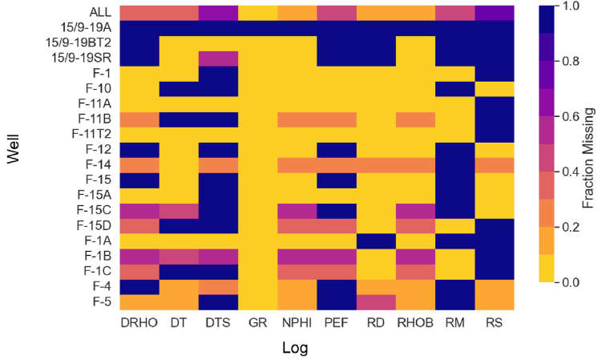
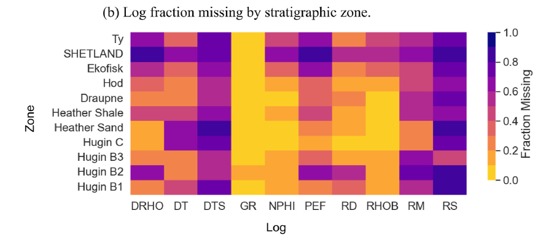
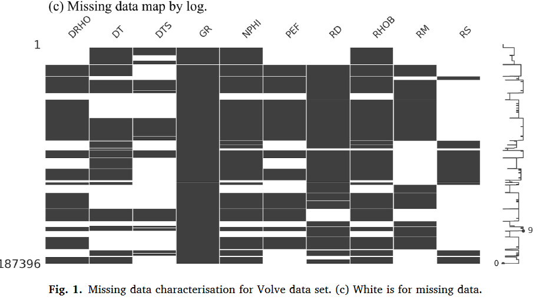

# 3.Test data, preprocessing and conditioning | 测试数据、预处理和条件

This study utilises two distinct well log data sets selected due to their open availability, their preconditioning, comprehensive labelling and curation by subject matter experts.

本研究使用了两套不同的井下测井数据集，它们因其开放可用性、预处理、全面的标注以及领域专家的整理而被选中。

Each data set coversa distinct spatial scale representing an increasing level of geological diversity and subsequent imputation difficulty.

每个数据集覆盖了不同的空间尺度，代表了日益增长的地质多样性和随之而来的插补难度。

Exact information about the preconditioning applied to the two data sets is not available but examination of the logs suggests the following processes have been applied and conditions have been met.

关于对这两个数据集所施加的预处理的确切信息并不可用，但通过检查测井记录，可以推测已经应用了以下过程并满足了以下条件：

1. Logs from multiple tools runs have been depthaligned and merged to generate a single log for each measurement type. 来自多次工具运行的记录已经进行了深度对齐并合并，以生成每种测量类型的单独记录。
2. Significant noise has been edited from the data. For Volve, this was performed by the authors. 已经从数据中编辑了大量噪声。对于Volve数据集，这一工作由作者完成。
3. Common logs (e.g. gamma-ray) have been normalised to account for variations in tool models and calibration settings. 常见的记录（例如伽马射线）已经标准化，以考虑工具型号和校准设置的变化。
4. Lithostratigraphic interpretations provided with the trainingdata are accurate and complete. 与训练数据一同提供的岩石地层解释准确且完整。

## 3.1.Volve

The Volve data set comprises 20 wells from a single oil field in the Norwegian North Sea.
Volve数据集包括**挪威北海**一个**单一油田**的**20口井**。
The data was releasedby Equinor in 2018 as part of a complete field data set.
该数据由Equinor在2018年作为一套完整区域(field)的数据集发布。
The drilling of the wells spans approximately 20 years with initial exploration and appraisal wells often having more complete log suites (Hallam et al., 2020).
这些井的钻探跨越了大约20年，最初的勘探和评价井通常具有更完整的测井套件（Hallam等，2020）。

The deepest part of the logs cover the reservoir and surrounding geological formations.
测井记录的最深部分覆盖了储层和周围的地质构造。
For the remainderof this study, the logs recorded shallower than the top Ty Formation have been removed.
对于本研究的其余部分，记录在Ty地层顶部以上较浅的部分已被移除。
The total number of samples available for learning is 172,167.
可用于学习的样本总数为172,167个。
Within the filtered data set, log coverage varies greatly; gamma-ray (GR) has almost no missing values for the zones of interest whilst shear-sonic (DTS) has over 60% missing values (Fig. 1(a)).
在筛选后的数据集中，测井覆盖范围差异很大；伽马射线（GR）在感兴趣的区域几乎没有缺失值，而剪切声波（DTS）的缺失值超过60%（图1（a））。
The three key elastic logs, density, compressional sonic and shear sonic have coverage of 80%, 60% and 35% respectively.
三个关键的弹性测井，密度、纵波速度和剪切波速度的覆盖率分别为80%、60%和35%。

图一：

按照井计算的测井数据缺失率。

fraction missing: 缺失率，fraction: 分数，missing: 缺失

该图为missingno所绘制的缺失热力图，该图显示了每口井的测井数据不同测井曲线的缺失率。

图中的每一行代表一口井，每一列代表一种测井曲线，颜色越深，缺失率越高。

该图显示了Volve数据集中测井曲线的缺失率差异很大，伽马射线（GR）在感兴趣的区域几乎没有缺失值，而剪切声波（DTS）的缺失值超过60%。

Well Name 图中井的名称含有的信息：Total Wells: 20 (including the "ALL" category)

ALL
15/9-19A
15/9-19BT2
15/9-19SR
F-1
F-10
F-11A
F-11B
F-11T2
F-12
F-14
F-15
F-15A
F-15C
F-15D
F-1A
F-1B
F-1C
F-4
F-5

Log Features 测井记录特征名称：Total Log Features: 10

DRHO
DT
DTS
GR
NPHI
PEF
RD
RHOB
RM
RS

These wells represent different drilling locations, while the log features represent various types of measurements taken from those wells.
这些井代表不同的钻探地点drilling locations，而测井曲线代表不同的测井特征logging features。

The heatmap visualizes the fraction of missing data for each type of log measurement across the different wells, where the color intensity indicates the proportion of data that is missing.

The heatmap 直观显示了各种测井测量数据的缺失比例，颜色强度代表缺失数据的比例。

The second heatmap (b) displays the fraction of log data missing, organized by stratigraphic zone rather than by well.

第二张图（b）显示了按地层带而不是按井组织的测井数据缺失率。

This visualization helps to understand how the completeness of log data varies across different geological layers, which can be crucial for geological and reservoir modeling.

有助于了解在测井数据的完整性在不同地质层之间的差异或变化情况，对于地质和储层建模至关重要。

stratigraphic zone: 地层带 stratigraphic: 地层的，stratic: 层的，graphic: 图形的，zone: 地带。
"stratigraphic"这个词的字面意思是"关于地层的写作或绘图"，但在地质学中，它通常用来描述与地层或岩层的形成、分布、年代等有关的研究。在石油地质学中，"stratigraphic zone"（地层带）通常指的是具有某种特定地质属性或特征的岩石层的垂直或水平范围。这些特性可能包括岩石类型、化石内容、沉积环境、年代等。地层带是地质学家用来描述和理解地层和地质时间的重要工具。在石油勘探和开发中，地层带可以帮助地质学家确定最有可能找到石油或天然气的地方。

1. Stratigraphic Zones: 地层带
    The heatmap identifies several stratigraphic zones, from the topmost 'Ty' to the bottom 'Hugin B1'. These zones likely correspond to different geological formations encountered in the drilling process, each with distinct characteristics.
    热图确定了几个地层带，从最上面的 "Ty "到最下面的 "Hugin B1"。这些区域可能与钻探过程中遇到的不同地质构造相对应，各有特点。
2. Missing Data by Zone: 按地层带缺失数据
    Each stratigraphic zone shows a different pattern of missing log data, which could be due to various reasons such as the geological complexity of the formation, the quality of the logging tools in those layers, or operational issues during data acquisition.
    每个地层带都显示出不同的测井数据缺失模式，这可能是由于各种原因造成的，例如地层的地质复杂性、这些地层中测井工具的质量或数据采集过程中的操作问题。
3. Patterns of Missing Data: 缺失数据的模式
   1. Some logs, like 'GR' (Gamma-Ray), show low levels of missing data across most zones, indicating that gamma-ray logging is a relatively consistent and reliable measurement throughout the drilling process.
   一些测井，如“GR”（伽马射线），在大多数区域显示低水平的缺失数据，表明伽马射线测井是整个钻井过程中相对一致和可靠的测量方法。
   2. 'DTS' (Shear Sonic) has high levels of missing data across almost all zones, suggesting that acquiring shear sonic logs is challenging or less prioritized in these stratigraphic layers.
   “DTS”（剪切声波）在几乎所有区域都有大量缺失数据，这表明在这些地层中获取剪切声波测井具有挑战性或优先级较低。
   3. Other logs like 'DRHO' (Density Correction), 'PEF' (Photo Electric Factor), and 'RD' (Deep Resistivity) exhibit moderate to high variability in missing data across different zones.
    其他测井，如“DRHO”（密度校正）、“PEF”（光电因数）和“RD”（深电阻率），在不同区域的缺失数据中表现出中度到高度的变异性(变化性)。
4. Implications for Analysis：对分析的影响
   1. Data Imputation: Zones with higher levels of missing data may require more sophisticated imputation methods to fill in the gaps for a comprehensive analysis.数据插补：缺失数据水平较高的区域可能需要更复杂的插补方法来填补空白，以便进行全面分析。
   2. Modeling and Interpretation: The completeness of log data in certain zones will impact the confidence and resolution of geological models. 建模和解释：某些区域测井数据的完整性将影响地质模型的置信度和分辨率。
   For instance, the stratigraphic zone 'Heather Sand' shows a significant fraction of missing 'DTS' and 'RD' data, which could lead to uncertainties in the mechanical and resistive properties of this layer.例如，地层带“Heather Sand”显示出很大一部分缺失的“DTS”和“RD”数据，这可能导致该层的机械和电阻特性的不确定性。
   3. Data Acquisition Focus: The heatmap can guide future data acquisition strategies to target zones with insufficient data, especially if these zones are of particular interest for resource evaluation or drilling decisions.数据采集重点：热图可以指导未来的数据采集策略，以达到数据不足的目标区域，特别是当这些区域对资源评估或钻探决策特别感兴趣时。

In summary, this heatmap provides a stratigraphic perspective on data availability, highlighting potential data reliability and quality issues that could affect subsurface modeling and analysis efforts.总之，该热图提供了数据可用性的地层视角，突出了可能影响地下建模和分析工作的潜在数据可靠性和质量问题。

It's a valuable tool for planning further data collection and for deciding on the most appropriate data preprocessing strategies.它是规划进一步数据收集和确定最合适的数据预处理策略的宝贵工具。

图形分析：

- Ty: This is the uppermost zone shown and seems to have relatively low missing data across most log types, which suggests good data coverage.Ty：这是热力图（该数据下的热力图）的最上方区域，在大多数测井日志类型中，缺失数据似乎相对较低，这表明数据覆盖率良好。
- SHETLAND: This zone has higher missing data in the 'DTS' log, indicating potential difficulties in measuring or recording shear sonic data in this layer.该区域在“DTS”日志中缺失的数据较高，表明在该层中测量或记录剪切声波数据存在潜在困难。
- Ekofisk: Notable for its higher missing data in the 'DTS' and 'RD' logs, suggesting that sonic and resistivity measurements are challenging in this zone.Ekofisk：值得注意的是，在“DTS”和“RD”测井中缺失的数据较高，这表明该区域的声波和电阻率测量具有挑战性。

Overall, the heatmap suggests that while some logs like 'GR' and 'RHOB' are well-represented across stratigraphic zones, others, notably 'DTS' and 'RD', are frequently missing, which could lead to gaps in understanding the mechanical and electrical properties of these formations.
总体而言，热图表明，虽然“GR”和“RHOB”等一些测井在地层区域中具有很好的代表性，但其他测井，特别是“DTS”和“RD”，经常缺失，这可能导致在理解机械和这些地层的电特性。

共计187396个样本数据，特征有10个，从地层带缺失热力图中可以看出大概是：从：
Ty
SHETLAND
Ekofisk
Hod
Draupne
Heather Shale
Heather Sand
Hugin C
Hugin B3
Hugin B2
Hugin B1
共11层地层带。

## 3.2 Force 2020 well log machine learning data set Force 2020 测井机器学习数据集

A second larger test data set containing more than 90 wells from offshore Norway has been used to test the generalisation of this imputation methodology beyond closely related geological areas.
第二个更大的测试数据集包含来自挪威海上的90多口井，用于测试这种插补方法在地质区域密切相关之外的推广能力。
The data set was originally created for the Force 2020 Machine Predicted Lithology(F2020) (Bormann et al., 2020) competition.
该数据集最初是为Force 2020机器预测岩性（F2020）（Bormann等，2020）竞赛创建的。

The F2020 data set is provided in a pre-existing train and test split created arbitrarily by the data provider.
F2020数据集由数据提供方任意创建的预先存在的训练和测试分割提供。

The split uses blind well testing, a method considered to offer a more realistic measure of the predictive capacity of models.
分割使用盲井测试，这种方法被认为能更真实地衡量模型的预测能力。
The 10 test wells are evenly distributed spatially within the input data, but the percentageof missing values per input log can vary dramatically between the training and test sets (Table 1).
10个测试井在输入数据中的空间分布均匀，但训练集和测试集中每个输入测井的缺失值百分比可能有很大差异（表1）。

The total size of the F20 data set is 1,307,118 samples with approximately 10.5% belonging to the test set.
F20数据集的总样本量为1,307,118个，其中大约10.5%属于测试集。
The elastic logs DTC, DTS and RHOB have missing values of 6.9%, 85.1% and 13.8% respectively (Fig. 2).
弹性测井DTC、DTS和RHOB的缺失值分别为6.9%、85.1%和13.8%（图2）。
Note that DTC is a common alias for DT and we use it here to remain consistent with the source data.
请注意，DTC是DT的常见别名，我们在这里使用它是为了与源数据保持一致。

Due to the spatial extent of the data set, some of the additional logs provided have been included as imputation constraints, namely, the Cartesian coordinates of the sample (X_LOC, Y_LOC) but drilling metrics and non-critical logs with a large proportionof missing values have been excluded, specifically bit size (BS), rate of penetration (ROPA), mudweight (hydrostatic pressure in well while drilling), and spectral gamma-ray (SGR).
由于数据集的空间范围，一些额外提供的测井已经被纳入作为插补约束，即样本的笛卡尔坐标（X_LOC，Y_LOC），但钻井指标和具有大量缺失值的非关键测井被排除在外，特别是钻头尺寸（BS）、钻进速率（ROPA）、泥浆重量（钻井时井内的静水压力）和光谱伽马射线（SGR）。

## log editing, scaling and feature engineering 测井编辑、缩放和特征工程

Log editing, transformations and scaling are necessary data cleaning processes for most imputationalgorithms.
测井编辑、转换和缩放是大多数插补算法所需的数据清理过程。

Significant edits are as per the beginning of this section but scaling of logs to suit predictionalgorithms is required.
重要的编辑如本节开始所述，但为了适应预测算法，需要对测井进行缩放。

A common process is to scale each sample of an input log x~i~ to a new feature x' by the mean μ~x~ and standard deviation σ~x~ of x (Sarkar et al., 2018), sometimes referred to as centering and scaling.
一个常见的过程是将输入测井的每个样本x~i~按照x的均值μ~x~和标准差σ~x~缩放到新特征x′（Sarkar等，2018），有时被称为中心化和缩放。

x′~i~ = ( x~i~ - μ~x~ ) / σx (3.1)

This removes inherent bias due to differencesin scale and ensuresall features cover a common range.
这消除了由于尺度差异而造成的固有偏差，并确保所有特征覆盖一个共同的范围。
The scaling factors μ~x~ and σ~x~ are stored so that, after imputation logs can be returned to their original scale.
缩放因子μ~x~和σ~x~被存储起来，以便在插补后可以将测井恢复到其原始尺度。

Some logs require additional consideration prior to imputation.
一些测井在插补前需要额外考虑。

Resistivity logs naturally exhibit a logarithmic scale inherent to the measurements made by the logging tool (Darling, 2005).
电阻率测井自然呈现出测井工具测量时固有的对数尺度（Darling，2005）。

To improve the linear correlation and low end sensitivity between the resistivity and other logs, they have been transformedthrough a base 10 logarithm.
为了改善电阻率与其他测井之间的线性相关性和低端敏感性，它们已通过基数10的对数转换。
For example the deep resistivity is transformed to the imputation feature RESD10 via the relationship RESD10 = log10 (RESD).
例如，深层电阻率被转换为插补特征RESD10，通过关系RESD10 = log10 (RESD)。

Categorical logs such as the Well ID and Stratigraphic Formation were transformed to numeric values through an integer encoder.
诸如井ID和地层地层等分类测井被通过整数编码器转换为数值。
For algorithms such as KNN regression, the distance between integers may affect the results.
对于像KNN回归这样的算法，整数之间的距离可能会影响结果。
Adjacent or similar formations should therefore be given similar integer values.
因此，相邻或相似的地层应该被赋予相似的整数值。
This is less critical for tree ensemble approaches.
这对于树集成方法来说不那么关键。

## 3.4. Feature selection 特征选择

For feature selection, we defer to expert domain knowledge of the measured logs, as well as the percentage of missing values.
对于特征选择，我们遵循测量测井的专家领域知识，以及缺失值的百分比。
Very sparse logs are excluded due to the limited information they contain.
由于包含的信息有限，非常稀疏的测井被排除在外。
We make an exception for the shear-sonic which we wish to predict even if missing.
我们为剪切声波测井做了一个例外，即使缺失，我们也希望预测它。
We also exclude engineering or borehole specific logs (e.g. caliper) that are not directly correlated with geological measurements.
我们还排除了与地质测量不直接相关的工程或钻孔特定测井（例如，口径,也可以称为井径）。

## 3.5.Test data preparation 测试数据准备

Data sets were first split into training and test data sets based upon wells.
首先根据井将数据集分为训练和测试数据集。
The Volve blind test wells were F-4, F-12, F-1& F-15D.
Volve的盲测试井是F-4、F-12、F-1和F-15D。
The testing split for the Force 2020 data set was provided with the data.
Force 2020数据集的测试分割是随数据提供的。
For training evaluation a further reduction of the training set was applied for each target log (DT/DTC, DTS, RHOB).
为了训练评估，对每个目标测井（DT/DTC、DTS、RHOB）进一步减少了训练集。
This reduction created a unique training set for evaluating the predictive capacities of models for DT/DTC, DTS and RHOB individually.
这种减少创建了一个独特的训练集，用于评估模型对DT/DTC、DTS和RHOB的预测能力。
This approach was taken because aggressive sub-setting of all target logs would have overdecimated the training data set.
采取这种方法是因为对所有目标测井进行激进的子集化会过度减少训练数据集。
For testing, a further 30% of nonmissing values were used from each target log.
对于测试，进一步使用了每个目标测井中30%的非缺失值。
The data was removed in a random fashion so as not to significantly alter the distributions of values available for prediction training.
数据以随机方式移除，以免显著改变可用于预测训练的值分布。
The high coverage of RHOB available in the Volve data set limited our ability to test the capacity for imputation when RHOB is not acquired.
在Volve数据集中可用的RHOB的高覆盖率限制了我们测试在未获得RHOB时插补能力的能力。
Thus, to improve the testing of the Volvedata set we introduce a block of missing RHOB values to simulation situations where all three elastic logs are missing.
因此，为了改善Volve数据集的测试，我们引入了一个缺失RHOB值的块，以模拟所有三个弹性测井都缺失的情况。
